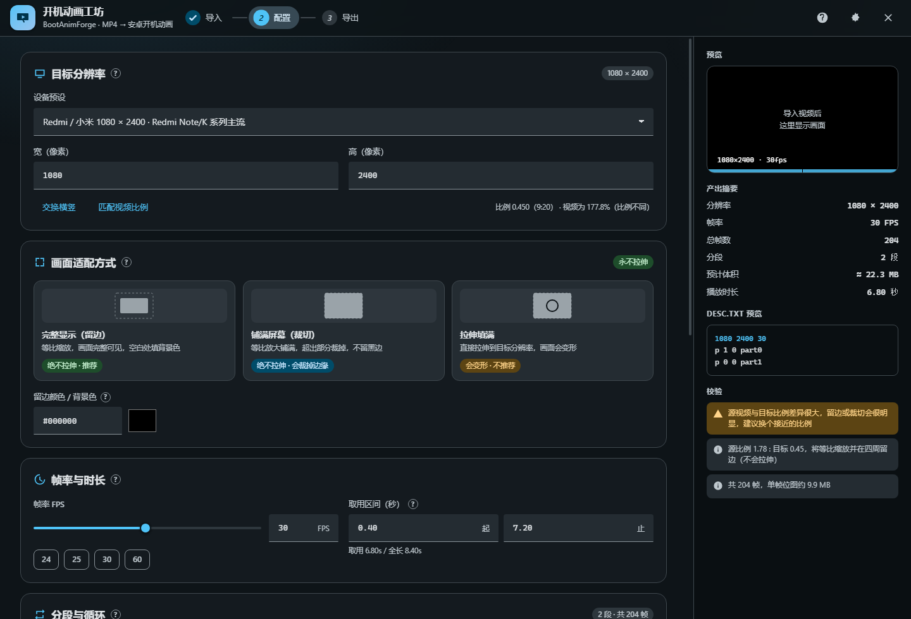

# 开机动画工坊 · BootAnimForge

把 MP4 等视频转成安卓开机动画（`bootanimation.zip`）的 Windows 工具。

界面是 Material Design 3 风格，带非线性动效（MD3 emphasized 曲线）、实时预览、时间轴分段编辑器和内置教程。
引擎是本地 ffmpeg，界面在独立的 Edge 应用窗口里运行 —— 不依赖 Electron，不装 npm 包，改代码不用编译。



---

## 快速开始

双击 **`启动.cmd`**（文件名是中文，但文件内容刻意只写 ASCII —— 原因见下）。

首次运行会自动准备视频引擎（ffmpeg/ffprobe，约 115 MB，走 npm 镜像，实测几秒），然后弹出应用窗口。

> **为什么 `.cmd` 里不能写中文**：cmd.exe 在 `chcp 65001` 生效**之前**就已经按 OEM 代码页
> （中文系统是 GBK）解析整个批处理文件。UTF-8 编码的中文注释会被解析成一堆乱码命令并逐条执行，
> 导致启动器莫名其妙地失败。所以 `启动.cmd` 与 `tools/*.cmd` 一律只写 ASCII，
> 中文说明放在这里和 `src/` 的注释里。（这个坑真踩过。）

其它启动方式：

| 命令 | 说明 |
|---|---|
| `启动.cmd --quiet` | 控制台不刷 ffmpeg 日志（`启动.cmd` 默认已带） |
| `启动.cmd --browser` | 改用系统默认浏览器的标签页，不开独立窗口 |
| `启动.cmd --port 17321` | 固定端口（默认 17321，被占用时自动换） |
| `node tools/server-ctl.js start` / `stop` / `status` | 开发用：后台启停，PID 记录在 `.work/server.pid`；`stop` 会连占着端口的旧实例一起清掉 |
| `node tools/server-ctl.js open` | 服务已在跑时，只把应用窗口打开 |

要求：Windows 10/11 + Node.js ≥ 18 + Edge（或 Chrome）。ffmpeg 已随包放在 `runtime/`。

> 重复点「启动.cmd」不会开出第二个服务：检测到已有实例就直接复用并弹窗口。

---

## 三步走

1. **导入** —— 拖入视频，或点「按路径浏览视频…」。程序读取分辨率、时长、帧率、旋转、HDR、alpha。
2. **配置** —— 目标分辨率（机型预设/自定义）、适配方式、帧率、取用区间、分段与循环、输出选项。
3. **导出** —— 检查 `desc.txt` 与预检结果，一键转换。

右侧边栏实时显示：预览帧、产出摘要（帧数/预计体积/播放时长）、`desc.txt` 预览、参数校验。

### 核心能力

- **绝不拉伸**：等比缩放 + 居中留边（可配背景色），或等比放大 + 居中裁切；「拉伸」只是给高级用户的显式选项，且有警告。
- **分段与循环**：时间轴上随时切分，每段独立设置 `p/c/f` 类型、循环次数（0 = 无限）、暂停帧数、淡出帧数、背景色。
- **试播**：按 `desc.txt` 的真实播放逻辑（循环次数 + 暂停）模拟一遍，直观看到开机时会怎么播。
- **合规输出**：`desc.txt` 严格按 AOSP 规范生成；zip 默认 `STORE`（等价 `zip -0`），帧按序存放，产出前自动自检。
- **大量可自定义项**：分辨率、帧率、图片格式（PNG 三档压缩 / JPEG 质量）、透明通道、背景色、zip 压缩、输出目录与文件名、每段音效 `audio.wav`。

### 快捷键

| 键 | 功能 |
|---|---|
| `Ctrl+O` | 打开视频选择 |
| `Ctrl+Enter` | 在导出页开始转换 |
| `空格` | 配置页试播 / 停止 |
| `F1` | 使用教程 |
| `Esc` | 关闭浮层 |

---

## 产出长什么样

```
bootanimation.zip
├── desc.txt
├── part0/
│   ├── frame_00000.png
│   ├── frame_00001.png
│   └── …
└── part1/
    └── …
```

`desc.txt`（AOSP 规范）：

```
1080 1920 30            ← 宽 高 帧率 [是否显示进度条]
p 0 0 part0             ← 类型 循环次数 暂停帧数 目录
c 1 15 part1 #000000    ← …可选背景色
```

- **类型**：`p` 开机未结束就循环、可被打断；`c` 必须播完；`f` 同 `p`，但被打断时淡出指定帧数
- **循环次数**：`0` = 一直循环到开机完成
- **暂停**：该段播完后停顿的**帧数**（不是秒）；30fps 下 30 帧 = 1 秒

细节见 [docs/bootanimation-format.md](docs/bootanimation-format.md)。

### 刷入手机

1. **先备份** `/system/media/bootanimation.zip`
2. **Magisk 模块**（推荐）：把 zip 放进模块的 `system/media/` 下打包刷入，不动系统分区
3. **直接替换**（Root）：复制到 `/system/media/` 或 `/product/media/`，权限 `rw-r--r--`（0644），重启
4. **TWRP**：在 recovery 的文件管理器里覆盖

常见路径：`/system/media/`、`/product/media/`、`/oem/media/`。

> ⚠️ 文件损坏或权限不对会导致开机黑屏（系统仍能启动，但看不到动画）。所以务必先备份。

---

## 项目结构

```
BootAnimForge/
├── 启动.cmd                  启动器（首次运行会拉 ffmpeg）
├── package.json
├── src/                      后端（Node，零依赖）
│   ├── main.js               入口：找端口、开窗口、静默模式
│   ├── server.js             HTTP + SSE 进度 + 静态资源 + 文件浏览 API
│   ├── convert.js            转换流水线（探测→校验→抽帧→desc→打包→自检）
│   ├── desc.js               desc.txt 生成、分段计划、参数校验
│   ├── ffmpeg.js             ffmpeg/ffprobe 封装、**永不拉伸**的滤镜构造、版本适配
│   ├── zip.js                ZIP 读写（STORE/DEFLATE）+ 结构自检
│   └── util.js               小工具
├── public/                   前端（原生 ES Module，无构建）
│   ├── index.html
│   ├── css/app.css           MD3 设计令牌 + 组件 + 动效
│   └── js/{app,core,data}.js 交互 / 状态与 API / 预设与文案
├── tools/
│   ├── fetch-ffmpeg.js       获取 ffmpeg 运行时（多源回退）
│   ├── selftest.js           后端端到端自检（合成素材，45 项断言）
│   ├── uicheck.js            无头 Edge + CDP 检查前端与整条流程
│   └── server-ctl.js         开发用启停
├── runtime/                  ffmpeg.exe / ffprobe.exe（自动下载，不入库）
├── docs/                     规范说明、截图
└── output/                   默认输出目录
```

### 为什么这么设计

| 决定 | 原因 |
|---|---|
| 零 npm 依赖 | 后端只用 Node 内置模块；不用装包、没有供应链风险、不会因依赖过期而腐烂 |
| 前端无构建 | 原生 ES Module + CSS 变量。改一行 CSS，刷新即见 |
| 界面用 Edge 应用窗口 | 不背 Electron 的 200 MB；窗口无地址栏无标签，手感和原生一致 |
| 自写 ZIP 写入器 | 通用 zip 库会改变条目顺序或强制压缩；开机动画要求帧**按序存放**且推荐**不压缩** |
| ffmpeg 走 npm 镜像 | gyan.dev / GitHub 在本机实测 0.04 MB/s（要 45 分钟），npmmirror 是 25 MB/s（几秒） |

---

## 自检与验证

```bash
node tools/fetch-ffmpeg.js        # 准备引擎
node tools/selftest.js            # 后端端到端：45 项断言
node tools/server-ctl.js start    # 起服务
node tools/uicheck.js --flow      # 无头浏览器跑完整流程：21 项断言
```

`selftest.js` 会用 ffmpeg 合成测试素材（横屏、旋转、带 alpha），然后：

- 校验**没有拉伸**：解出 zip 里的真实帧，检查四角是背景色、中心是视频内容
- 校验旋转元数据（`rotate` 标签与 display matrix 两种来源）
- 校验 alpha 通道保留、JPEG 模式扩展名正确、帧数与时长相符
- 校验 zip 结构（`desc.txt` 存在、条目有序、无损坏）
- 校验任务取消、参数校验拦截

`uicheck.js` 用 Edge 无头模式 + DevTools 协议驱动真实界面：载入视频 → 改参数 → 切分 → 导出 → 真跑一次转换 → 校验产物，同时收集控制台错误。

---

## 已知限制

- **浏览器拿不到拖入文件的磁盘路径**（Chromium 的安全限制）。所以拖放/文件框之后如果不能确定路径，程序会引导你用「按路径浏览视频…」——读的是原文件，不复制不上传。
- **Android 12+ 的视频版开机动画**：部分新机型改用 `bootanimation.zip` 内含 `bootanimation.mp4` 的格式。本工具生成的是兼容性最好的传统 PNG 序列版本；新分支机型需要自行把 MP4 放进对应结构。
- **ffmpeg 版本**：随包的是 2018 年的构建（N-92722）。功能足够（lanczos 缩放、PNG/JPEG、旋转、alpha），代码里对 `-fps_mode`/`-vsync` 做了版本适配，换成新版 ffmpeg 也能直接用。
- **HDR 源**：转成 PNG/JPEG 会丢失 HDR 效果，界面会警告。

---

## 许可

本项目代码 MIT。`runtime/` 下的 ffmpeg/ffprobe 来自
[`@ffmpeg-installer`](https://www.npmjs.com/package/@ffmpeg-installer/win32-x64) /
[`@ffprobe-installer`](https://www.npmjs.com/package/@ffprobe-installer/win32-x64)（FFmpeg 官方构建，LGPL/GPL 见 `runtime/FFMPEG-LICENSE.txt`），
其许可独立于本项目。
